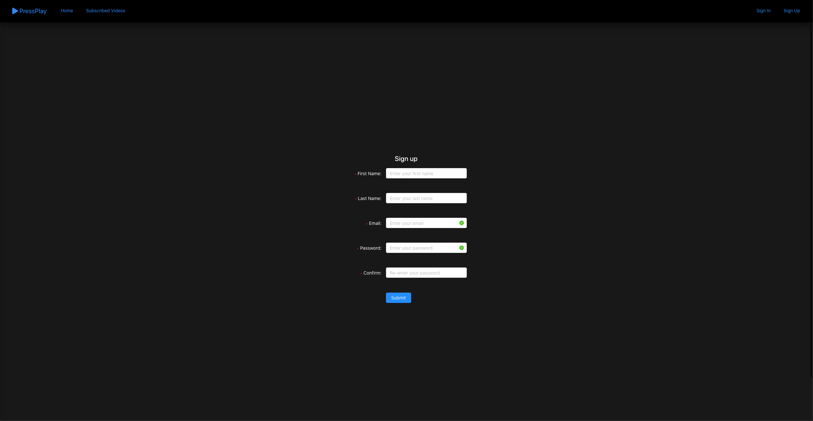
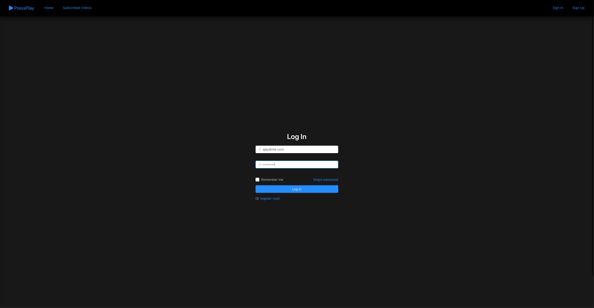
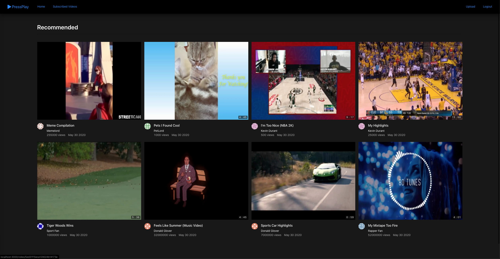
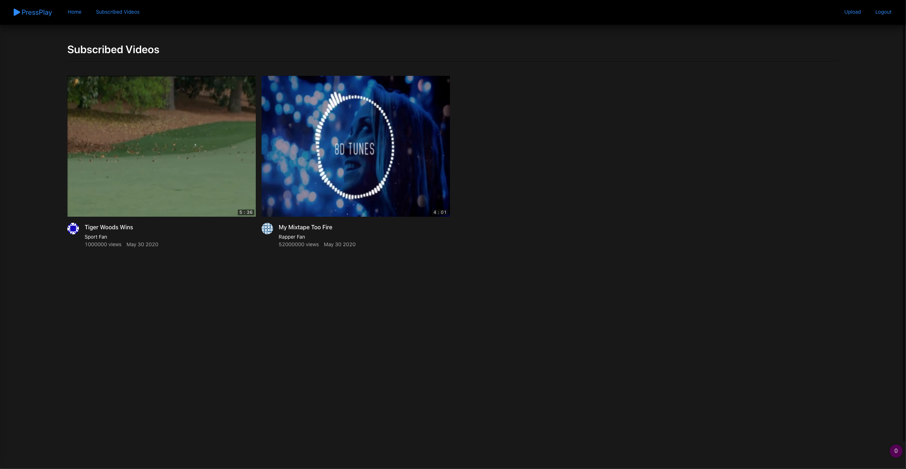
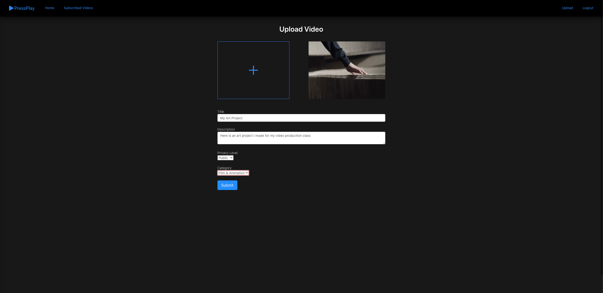
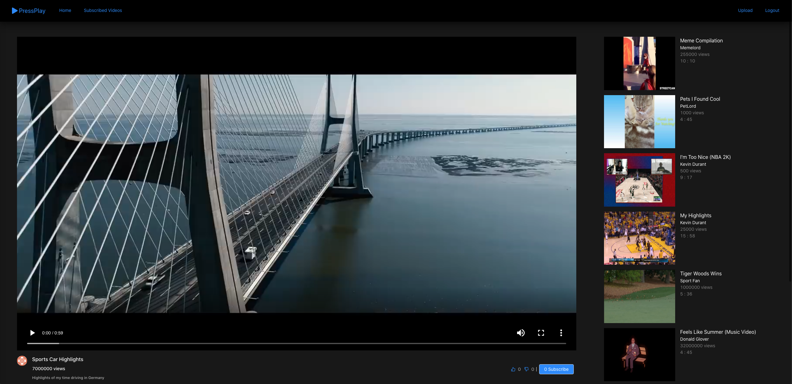
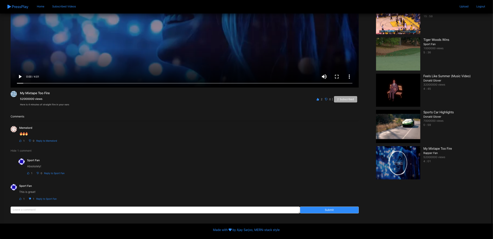

# PressPlay

PressPlay is a video streaming website that lets you upload and view videos, like/dislike them, and comment on others (a la YouTube kind of service).  

Built using the MERN stack (MongoDB, ExpressJS, ReactJS, NodeJS)

# Table of Contents
- [Installation](#Installation)
- [Features](#Features)
- [Dependencies/Libraries/Frameworks Used](#Dependencies)
- [To-Do](#To-Do)

## Installation
1. Clone this repository  
```bash
$ git clone https://github.com/asarj/PressPlay.git
```
2. Navigate to the `server/config` directory  
```bash 
$ cd server/config
```
3. Create a `dev.js` file  
```bash
$ touch dev.js
```
4. In the `dev.js` file, you will need to specify the URI to your MongoDB database.  
    1. This can be obtained by logging into your MongoDB account and heading to your database cluster. From here, the URI can be found at:  
    Clusters > Command Line Tools > Connect To Your Cluster > Connect Instructions > Connect your application (Make sure that Node.js is the selected driver and 3.0 or later is the selected version.)  
    2. Once you've navigated to the correct page that has your MongoDB URI, the connection string should look something like this:  
    `mongodb+srv://<username>:<password>@cluster0-jl7lm.mongodb.net/test?retryWrites`  
    where `<username>` is the username to your cluster account and `<password>` is the corresponding password to your account
    3. Copy this string and navigate back to `dev.js`, where you will paste the following code:  
    ```javascript
    module.exports = {
        mongoURI: '<insert MongoURI here>'
    }
    ```
    where `<insert MongoURI here>` is the connection string you found in step 4.2. You can also look at `dev-example.js` for a sample as to what it should look like
5. Save the `dev.js` file
6. Install the server dependencies  
    1. Navigate back to the project root directory
    ```bash
    $ cd ../../
    ```
    2. npm install the server dependencies
    ```bash
    $ npm install
    ```
7. Install the client/front-end dependencies
    1. Navigate to the client directory
    ```bash
    $ cd client/
    ```
    2. npm install the client dependencies
    ```bash
    $ npm install
    ```
8. Navigate back to the project root directory
```bash
$ cd ..
```
9. Run the application!
```bash
$ npm run dev
```
10. Visit `localhost:3000` to check it out!

## Features
### Sign Up Page
This is where you can register for an account in order to post videos and react to other users. All that is needed is your first and last name, email address, and password


### Sign In Page
You can sign in to the website here. You will be directed to this page right after registration, or if you click Sign In on the top right corner


### Homepage
This is the main screen of the webapp. Here you can see all videos that every other user has posted, including ones that you've uploaded as well. For each video, you can see the title, the publisher, view count, and post date. 


### Subscribed Videos
This is where you can view all the videos from people you subscribe to. For example, the user I have logged in as follows "Sport Fan" and "Rapper Fan," hence why they show up in this screen


### Upload a Video
If you wish to upload a video to share with the community, you can click the "Upload" link on the top right, where you'll be presented with a webpage that looks like the one below. Here you can upload any video of your choice by clicking the plus (+) button, and the webapp will generate a thumbnail for you. You have the option of entering in the video title, description, privacy rating (public or private) and category as well.


### Watch a Video
Clicking on any video on the homepage or subscribed video page will take you to a dedicated link in which you can view the video. On this screen, you can view the selected video, or click on another video on the side panel after watching the current one.


### Reactions
The platform gives users a variety of ways to interact with each other. While watching a video, you have the option to like or dislike the video, subscribe to the user, or leave a comment with your thoughts. You can also reply to other users' comments and like/dislike those too.


## Dependencies
- [Axios](https://github.com/axios/axios): a promise-based HTTP client for NodeJS
- [Ant Design](https://ant.design): a front-end framework used for styling simple and natural user interfaces
- [Express](https://expressjs.com): a back-end webapp framework for dealing with server-side requests
- [ffmpeg](https://ffmpeg.org): a library that was used to aid in video streaming for this webapp
- [JsonWebToken (JWT)](https://jwt.io): a secure way for transmitting information between parties as a JSON object
- [MomentJS](https://momentjs.com): a datetime library for JavaScript
- [Mongoose / MongoDB](https://www.mongodb.com): A general purpose NoSQL DBMS
- [ReactJS](https://reactjs.org): A front-end library developed by Facebook that is used for building front-end user interfaces
- [React-Redux](https://react-redux.js.org): used in conjunction with ReactJS to coordinate state management
- [React-Router](https://www.npmjs.com/package/react-router): handles routing endpoints in a webapp via dynamic routing
- [React-Dropzone](https://react-dropzone.js.org): a ReactJS hook library used for drag-and-drop file components

## To-Do
- Search bar functionality
- Dedicated user pages
- Modal alerts instead of browser alerts
- Machine learning integration for new videos to watch
- *Potentially* YouTube API integration